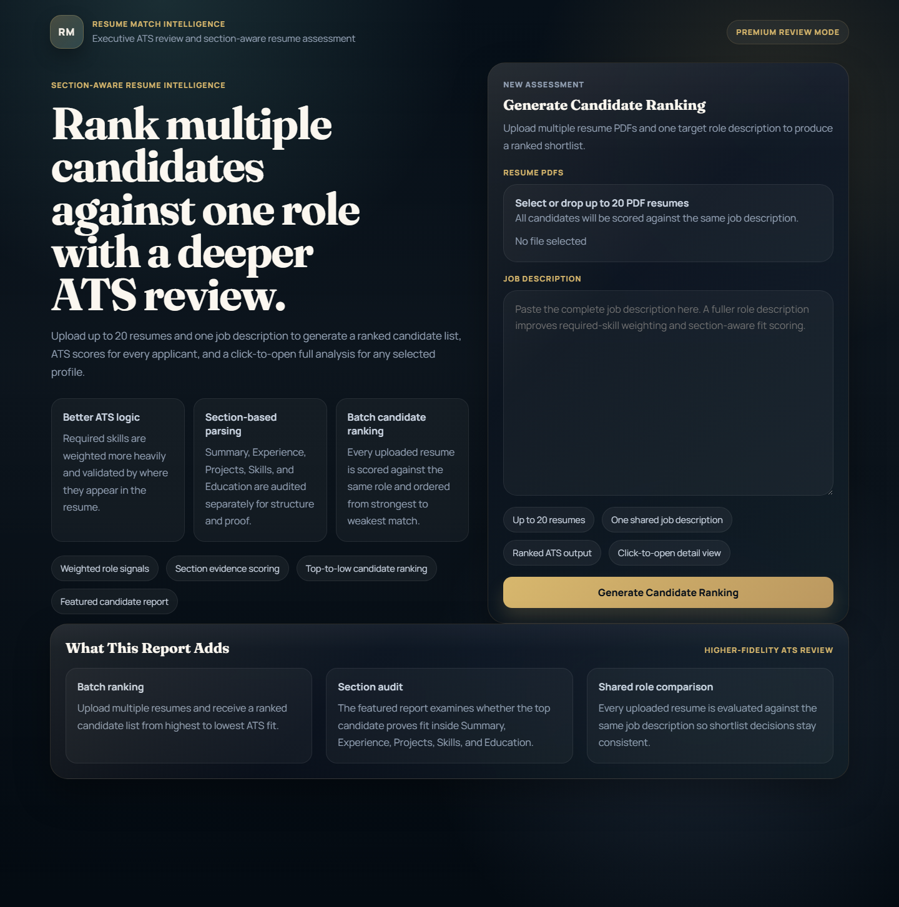

# ai-resume-analyzer

> A multi-resume ATS review dashboard that ranks candidates, explains fit, and exports shortlist results.

# Resume Match Intelligence

Resume Match Intelligence is a Flask-based ATS review tool that ranks multiple PDF resumes against one job description. It combines skill extraction, keyword overlap, section-aware evidence scoring, and semantic similarity into a recruiter-friendly dashboard with exportable shortlist results.

## What the current project does

- Upload up to 20 PDF resumes for one shared role description
- Rank candidates from strongest to weakest ATS-style fit
- Show a recruiter dashboard with score, experience, and coverage comparison
- Open a full detail view for any candidate in the ranked table
- Surface matched skills, missing skills, priority gaps, and revision suggestions
- Highlight matched role terms directly inside the extracted resume text
- Export the currently filtered shortlist to CSV or Excel

## Core workflow

1. Upload one or more text-based PDF resumes.
2. Paste the target job description.
3. The app extracts resume text with `pdfplumber`.
4. The analyzer compares each resume with the role using:
   - skill matching
   - keyword overlap
   - semantic similarity
   - section evidence scoring
   - ATS readiness checks
5. The UI returns:
   - ranked candidates
   - featured candidate analysis
   - section audit cards
   - category coverage and revision priorities
   - resume keyword highlights
   - CSV and Excel exports for the visible shortlist

## Tech stack

- Python
- Flask
- `pdfplumber` for PDF text extraction
- `scikit-learn` for TF-IDF similarity and scoring support
- `spaCy` when available, with regex fallback matching when it is not
- Vanilla HTML, CSS, and JavaScript for the dashboard UI

## 📸 Screenshots

### Home Page


### Result Dashboard

## Run locally

```bash
pip install -r requirements.txt
python app.py
```

Open `http://127.0.0.1:5000` in your browser.

## Run tests

```bash
python -m pytest -q
```

The automated test suite covers PDF parsing, batch ranking, section-aware analysis, keyword highlighting, and export payload generation.

## Project structure

- `app.py` - Flask routes, upload handling, ranking flow, and export payload preparation
- `resume_analyzer.py` - PDF parsing, NLP helpers, ATS scoring, highlighting, and recommendation logic
- `templates/index.html` - multi-candidate dashboard and candidate detail UI
- `static/styles.css` - premium dashboard styling
- `static/app.js` - candidate switching, filters, print support, and CSV/Excel download logic
- `tests/test_resume_analyzer.py` - automated tests for the current feature set
- `screenshots/` - refreshed UI screenshots and preview artwork
- `demo/` - demo notes and recording checklist
- `dataset/` - synthetic sample data for validation and portfolio use

## Screenshots and demo assets

- `screenshots/home.png` - current landing page with multi-resume upload and shared job description flow
- `screenshots/result.png` - current ranked dashboard with export buttons, candidate comparison, and detailed analysis
- `screenshots/preview.svg` - branded cover illustration aligned with the current product direction
- `demo/demo-script.md` - short walkthrough for recording a demo

## Notes and limitations

- Best results come from text-based PDFs with selectable text.
- Scanned resumes should be processed with OCR before upload.
- Resume scoring is heuristic and intended to support screening, not replace human review.
- Experience filtering relies on resume timelines when dates are detectable.
- Excel export is delivered as a browser-downloaded `.xls` file for easy spreadsheet opening.

## Dataset

The application does not require a training dataset because it analyzes uploaded resumes at runtime. A small synthetic dataset is included in `dataset/sample_pairs.csv` to help with demos, validation, and portfolio packaging.

## Portfolio positioning

This project works well as a portfolio or freelance demo for:

- recruiters and hiring teams
- HR tech prototypes
- internal resume screening tools
- career platform feature concepts

One-line pitch:

> A multi-resume ATS review dashboard that ranks candidates, explains fit, highlights missing signals, and exports shortlist results for recruiter workflows.
